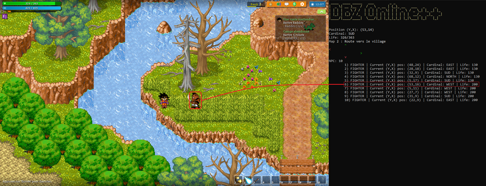
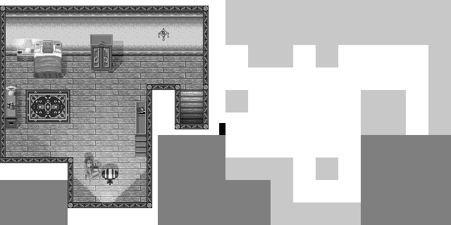
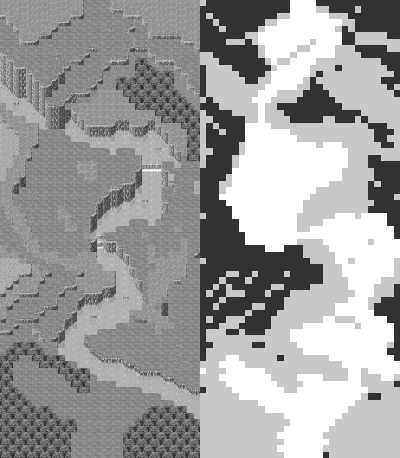
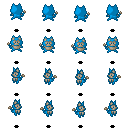

# DBZ Online++
  


## Introduction

**DBZ Online++** is a beta tool designed to enhance the experience of playing [DBZ Online](https://www.dbz-online.com/) by offering comprehensive information and enabling **automated farming**.

Additionally, it functions somewhat like an API, as it **accesses the game's memory directly** to provide extensive data, including:

- The player's **health**, **position**, and **orientation**
- Identification of **all NPCs on the map**, including their health, positions, and orientations — information not explicitly provided by the game.
- Details on **collisions and nearby players**

This tool is capable of **extracting maps and tiles**, as well as providing collision data. This enables players **to discover hidden passages on the map**.

This project is a **starting point** and there's **likely room for improvement** and restructuring in the code. It's set up for anyone interested in building on it and taking it further. **Feel free to dive in :)!**


Automated farming:


Some extracted information from the player and NPCs:

[](./imgs/npc.png)

Map Information Extraction:






## Setup
### Download

+ Clone the repository

```Shell
$ git clone https://github.com/zined1/dbz_online
```

+ Install dependencies
```Shell
# you can create a virtual environment using: python -m venv /path/to/new/virtual/environment
$ pip install -r requirements.txt # Python3
```

### Run

+ By default **DBZ Online** is installed in  ``%APPDATA%/Local/DBZOnline/``

Go into **app-9.X.X** (the latest folder) and open **dbzonline.exe**. Then run the main script
```Shell
$ python main.py
```


## More information

### Static Pointers

To manipulate memory, I used [Pymem](https://pymem.readthedocs.io/en/latest/) and for character movement, I utilized [PyDirectInput](https://pypi.org/project/PyDirectInput/). However, obtaining static pointers was challenging using [Cheat Engine](https://www.cheatengine.org/) alone, so I also used [IDA](https://hex-rays.com/ida-pro/) which yielded better results. Indeed, identifying static addresses for some pointers is not straightforward (see the table just below).

*``ProcessAddr``* is the default base address for executables (usually ``0x00400000``).In Pymem, I accessed this via ``pm.base_address``. To understand the table better, you can refer to ``process.py`` to review the code.


+**Character information**
| **Name**              | Address                                          | Read as |
|-----------------------|--------------------------------------------------|---------|
| PlayerOffset          | *(0x0048723c)                                    | int     |
| offset12              | \*(\*(*ProcessAddr* + 0x00086448) + 0x0c)        | int     |
| offset20              | \*(\*(*ProcessAddr* + 0x00086448) + 0x14)        | int     |
| xAddr                 | 0xb0 *×* (PlayerOffset - offset20) + offset12 + 0x1e |     |
| **xPos**              | *(xAddr)                                         | uchar   |
| **yPos**              | *(xAddr + 0x02)                                  | uchar   |
| **cardinalDirection** | *(xAddr + 0x04)                                  | uchar   |
| **life**              | *(xAddr + 0x06)                                  | int     |
| **curLife**           | *(xAddr - 0x0A)                                  | int     |


+**NPC information**
| **Name**              | Address                                          | Read as |
|-----------------------|--------------------------------------------------|---------|
| Number of NPC         | *(0x487078)                                      | int     |
| offset(n_th)          | 96 * n_th - 84                                   | int     |
| xAddr(n_th)           | \*(\*(*ProcessAddr* + 0x48706C) + offset(n_th))  |         |
| **xPos(n_th)**        | *(xAddr(n_th))                                   | uchar   |
| **yPos(n_th)**        | *(xAddr(n_th) + 0x02)                            | uchar   |
| **cardinalDirection** | *(xAddr(n_th) + 0x04)                            | uchar   |
| **curLife**           | *(xAddr(n_th) + 0x06)                            | int     |


+**Map information**
| **Name**              | Address                                          | Read as |
|-----------------------|--------------------------------------------------|---------|
| index_current_map     | \*(*ProcessAddr* + 0x86064)                      | int     |

### Parsing Maps

To move my character from a point (x<sub>s</sub>,y<sub>s</sub>) to another point (x<sub>e</sub>,y<sub>e</sub>) I need to know **where the collisions are**. Therefore, I require the map information. I noticed that **for each discovered map, a file (``.zm``) was downloaded** in ``%APPDATA%/Local/DBZOnline/maps/``. The ``.zm`` files **are used by DBZ Online only** so from my understanding, I wrote a parser (the file `extract_map.py`) to get:

- The map's name
- The associated background music file name
- Dimensions of the map
- The tiles associated with each coordinate
- The collisions and the height levels of the map

With this information, I can **reconstruct the map** with the types of platforms, collisions, the locations of NPCs, etc. However, to achieve a visual representation, I needed to **retrieve the tiles**.

I observed that the graphics files (`.df` in graphics folder) were initially unreadable, appearing to be protected by a simple mechanism that involved **deleting the headers** from JPEG and PNG files. By **simply identifying and restoring the correct headers** to these files, I was able to bypass 
this protection and make the files readable again. For more information you can check `decode_df.py`.



